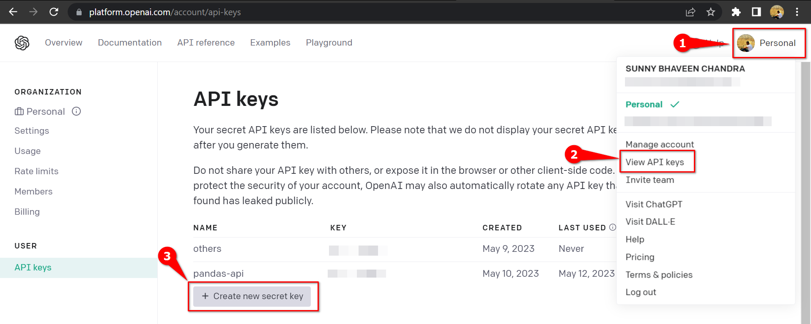

# supercharged-pandas

This is demo repository to show the capabilities of PandasAI python package.

Refer demo notebook [here](notebooks/demo.ipynb)

## Setup your Openai API key -

Create a `.env` file in the root of the project from the copy of `.env.template`.
And replace the OPENAI_API_KEY with your Openai API key

> NOTE: 1. You can obtain from - [OpenAI Keys](https://platform.openai.com/account/api-keys) 2. Refer the following screenshot - 

> ### IMPORTANT: PandasAI can work with python 3.9 onwards

## References -

1. [Pypi PandasAI](https://pypi.org/project/pandasai/)
2. [PandasAI github/docs](https://github.com/gventuri/pandas-ai)
